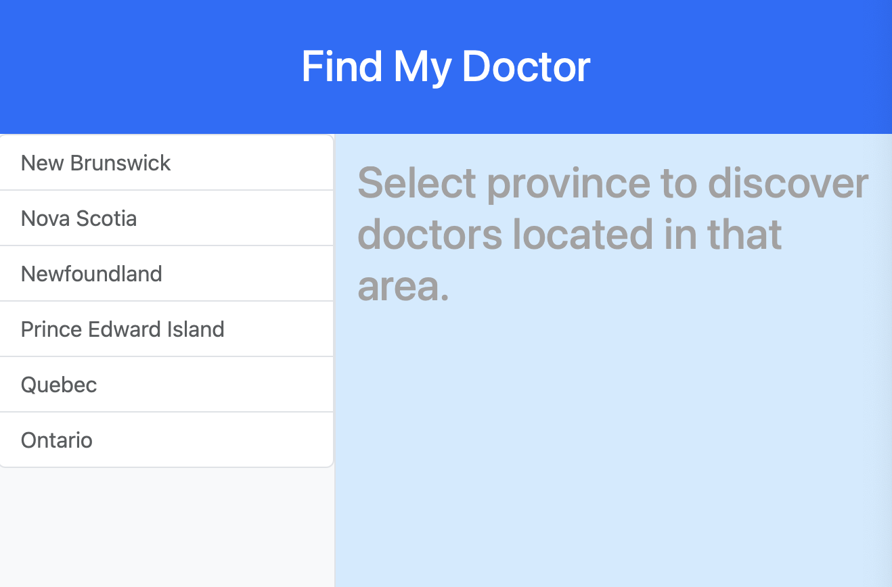
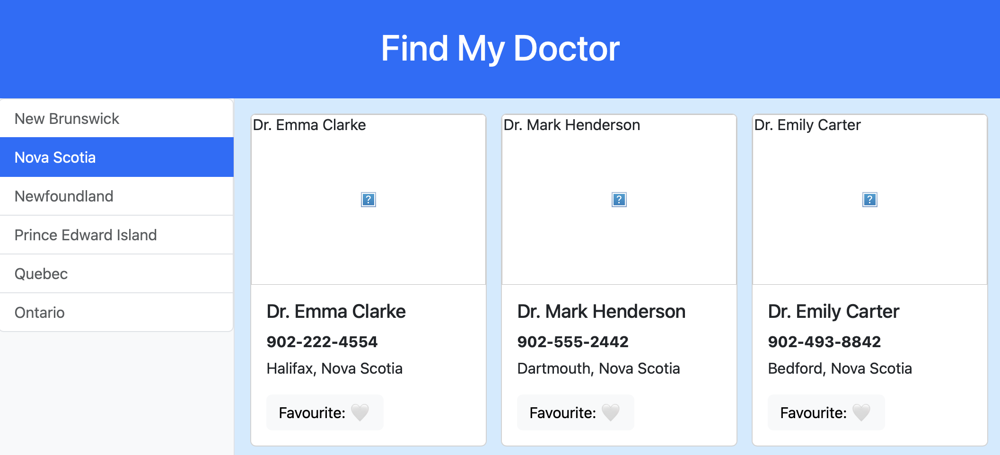
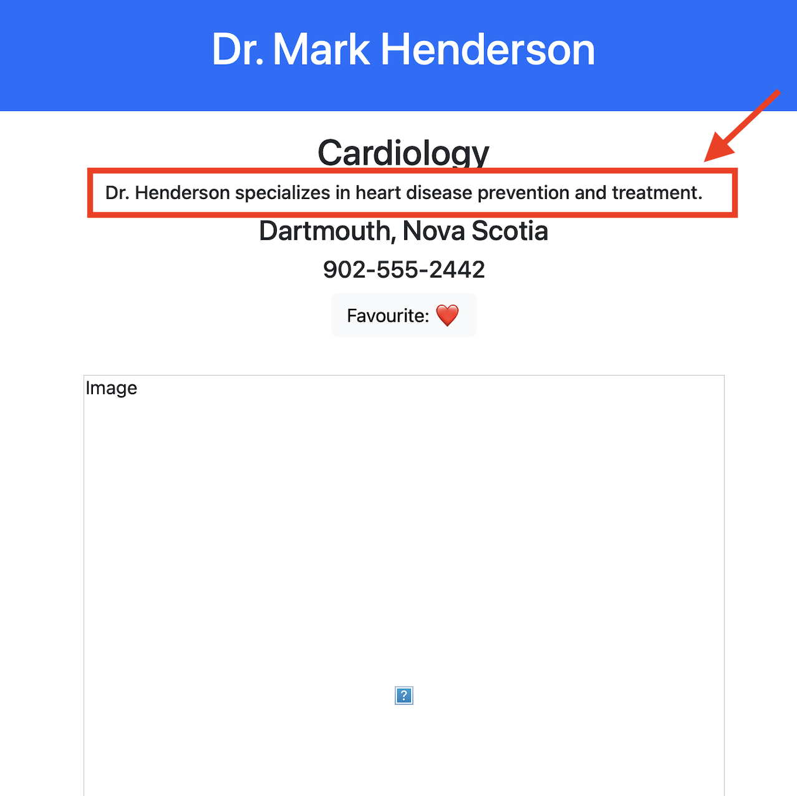

# FindMyDoctor

## Overview

FindMyDoctor is a simple React application that helps users find doctors in their province, including their contact information and location, and allows users to save favourites for quick reference.

---

## Purpose

FindMyDoctor was built to for the purpose of demonstrating my understanding of **React** and **Bootstrap**.

---

## Features:

- Users can:
  - Filter doctors by province
  - Select a doctor to view more details on a dedicated page

---

## Tech

- Hooks (useState, useNavigate)
- react-router-dom for navigation
  Bootstrap for styling
- JSON for storing doctor data (could be replaced with a database in the future)

---

## Example Images

### Home page:

### Viewing doctors in a province:

### Favouriting a Doctor:

### Selecting a doctor routes to the doctor's personal page where more information can be displayed:

#### Note the favourite still remains :)

